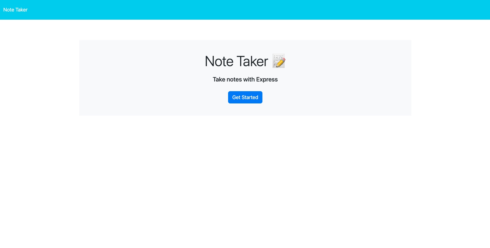
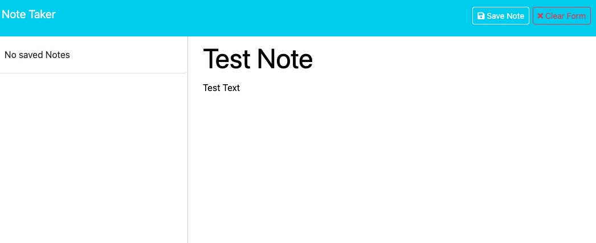

# ExpressJS Note Taker
## User Story
>GIVEN a note-taking application
>WHEN I open the Note Taker
>THEN I am presented with a landing page with a link to a notes page

>WHEN I click on the link to the notes page
>THEN I am presented with a page with existing notes listed in the left-hand >column, plus empty fields to enter a new note title and the note’s text in the >right-hand column

>WHEN I enter a new note title and the note’s text
>THEN a "Save Note" button and a "Clear Form" button appear in the navigation at >the top of the page

>WHEN I click on the Save button
>THEN the new note I have entered is saved and appears in the left-hand column >with the other existing notes and the buttons in the navigation disappear

>WHEN I click on an existing note in the list in the left-hand column
>THEN that note appears in the right-hand column and a "New Note" button appears >in the navigation

>WHEN I click on the "New Note" button in the navigation at the top of the page
>THEN I am presented with empty fields to enter a new note title and the notes text in the right-hand column and the button disappears

## Purpose
The app is a simple interface that allows you to take down notes and store them for reference later. The notes are stored in a `db.json` file. It simulates how front and back end technologies interact with eachother. the `db.json` file acting as a database.

## What I Learned
It was extremely interesting to see how to build a full stack application. I am looking forward to building on my skills with express. I know that I will continue to use organization like sticking my utils in their own folder and simply `require()` it in to the main `server.js`. It was interesting deploying through Heroku. 

## Screenshots

## Deployed APP
[Heroku App](https://express-note-taker-tjs-d3ed511e1297.herokuapp.com/)

## Credits
Credit to the developers of the NPM's used: node / express / uuid;
Also a big thanks to the helpers at askBCS;

## Code
Starter code provided by UofO bootcamp. Some code snippets used from UofO module 11 activities. 
